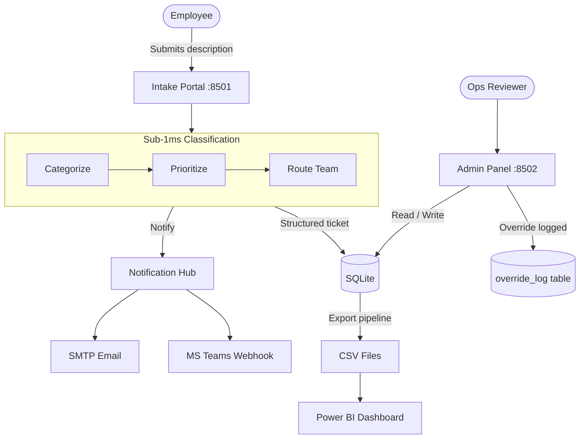

<div align="center">
  
</div>

<br>

# Smart Facilities Request Triage System

[](https://www.python.org/)
[](https://streamlit.io/)
[](https://www.sqlite.org/)
[](https://powerbi.microsoft.com/)
[](LICENSE)

A full-stack facility management automation prototype built to simulate how enterprise CMMS platforms like Maximo and Planon handle work order intake. The system takes an unstructured text description from a facility employee and, in under 1ms, returns a categorized, prioritized, team-routed ticket — with a complete override audit trail and Power BI analytics layer on top.

---

## Why I Built This

Most facility teams still route work orders through email threads or basic web forms with no automatic classification. A maintenance coordinator has to read each ticket, figure out whether it belongs to electrical, plumbing, or HVAC, assign a priority, pick the right team, and then notify them. At scale — hundreds of sites, thousands of requests — this is where things break down.

This project automates that middle layer. It is not production software, but it is built to the standard where it could serve as a working prototype for a real operations team.

---

## Interface

<div align="center">
  
  &nbsp;&nbsp;
  
</div>

<br>

<div align="center">
  
</div>

---

## How It Works

When a request is submitted through the intake portal, the triage engine runs three operations in sequence:

1. **Categorization** — scans the description for keyword patterns tied to 8 facility categories (HVAC, Electrical, Plumbing, Lighting, Furniture, Painting, Climate Control, Event Support). Uses word-boundary regex matching, so "ac" inside "replacement" does not trigger an HVAC match.

2. **Priority scoring** — maps the description against a priority keyword hierarchy (Critical, High, Medium, Low), checked in order so higher-severity terms always win.

3. **Team routing** — looks up the assigned team from a config map and pulls the corresponding SLA window (8h Critical, 24h High, 48h Medium, 72h Low).

The result is a structured ticket written to SQLite and a notification dispatched to both email and Microsoft Teams.

On the admin side, an operations reviewer can inspect open tickets, override the AI's classification decisions if they disagree, and close tickets. Every override — field changed, old value, new value, reviewer name — is written to a separate `override_log` table. This is what drives the AI accuracy metric: closed tickets with zero overrides count as correct predictions.

---

## Stack

| Layer | Technology |
|---|---|
| Intake UI | Streamlit (custom CSS, Inter + JetBrains Mono) |
| Admin UI | Streamlit (wide layout, sidebar, tabbed views) |
| Triage Engine | Pure Python — regex keyword matching, O(n) per request |
| Database | SQLite via `sqlite3` stdlib |
| Notifications | smtplib (SMTP/Gmail), requests (Teams webhook) |
| Analytics | Power BI Desktop — CSV flat file import |
| Export | pandas CSV export with deterministic calendar dimension |

---

## Project Structure

```
.
├── app/
│   ├── user_form.py          # Employee intake portal (port 8501)
│   ├── admin_panel.py        # Operations control center (port 8502)
│   ├── triage_engine.py      # Core classification logic
│   ├── notifier.py           # Email + Teams notification hub
│   └── db.py                 # SQLite connection and query helpers
├── scripts/
│   ├── init_db.py            # Schema creation
│   ├── seed_data.py          # 50-ticket demo dataset with override history
│   ├── generate_calendar.py  # Power BI calendar dimension
│   ├── export_for_powerbi.py # CSV export pipeline
│   └── verify_db.py          # Quick DB health check
├── docs/
│   └── powerbi_dax_guide.md  # 5-page dashboard spec + 12 DAX measures
├── data/
│   ├── triage.db             # SQLite database (gitignored)
│   └── exports/              # CSV exports for Power BI
├── images/                   # README screenshots
├── config.py                 # Site, team, SLA, and credential config
└── requirements.txt
```

---

## Setup and Run

### 1. Install dependencies

```bash
git clone https://github.com/Vaibhavsahkk/smart-ops-triage.git
cd smart-ops-triage
pip install "streamlit>=1.27" pandas faker requests
```

### 2. Initialize the database and seed demo data

```bash
python scripts/init_db.py
python scripts/generate_calendar.py
python scripts/seed_data.py
python scripts/export_for_powerbi.py
```

This creates a fresh SQLite database with 50 varied tickets across 8 categories — 35 closed (25 clean AI wins, 10 with reviewer overrides) and 15 open, giving a realistic 71.4% AI accuracy baseline to demo against.

### 3. Run both apps

Open two separate terminals from the project root:

**Terminal 1 — Employee intake portal:**

```bash
streamlit run app/user_form.py --server.port 8501
```

**Terminal 2 — Admin control center:**

```bash
streamlit run app/admin_panel.py --server.port 8502
```

Navigate to `http://localhost:8501` to submit requests and `http://localhost:8502` to review and close them.

### 4. Power BI dashboard

Open Power BI Desktop. Import these three files from `data/exports/`:

- `requests.csv`
- `overrides.csv`
- `calendar.csv`

Set a Many-to-One relationship from `requests[SubmittedDate]` to `calendar[Date]`. See `docs/powerbi_dax_guide.md` for the full 5-page layout and all 12 DAX measures.

---

## Notifications

Notifications are opt-in and fail silently. To enable them, open `config.py` and fill in:

```python
EMAIL_FROM = "your@gmail.com"
EMAIL_APP_PASSWORD = "your-app-password"
TEAMS_WEBHOOK_URL = "https://your-org.webhook.office.com/..."
```

Leave them blank to skip without any errors — the intake pipeline continues either way.

---

## Architecture



---

## Honest Notes

This is a portfolio project. A few things that would need to change before this runs in production:

- **SQLite to PostgreSQL** — SQLite works fine at low concurrency but is not the right choice for a multi-site facility team with hundreds of concurrent users.
- **Authentication** — The reviewer identity field in the admin panel is just a text input. Real deployment would need SSO, probably via Azure AD.
- **Triage engine** — The keyword matching approach is fast and explainable, but the `override_log` data is the right training signal for eventually moving to a proper text classifier. The architecture was designed with that transition in mind.
