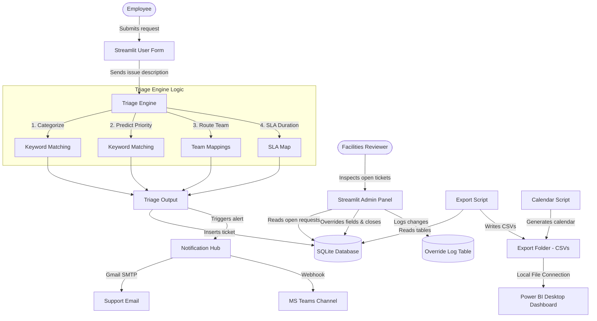

# Smart Facilities Request Triage System

## Problem
Facilities request flow in most organizations is manual: emails, Excel sheets, phone calls. The bottleneck is triage: categorizing, prioritizing, and routing requests to the right team. This system automates that flow with a human-in-the-loop feedback layer.

## Solution
An end-to-end automation pipeline containing:
- **Streamlit Web Form**: A modern user interface for employees to submit physical issues.
- **Rule-based Triage Engine**: Instant, low-overhead keyword-based classification, priority prediction, team routing, and SLA determination.
- **SQLite Database**: Structured storage with an audit log track for all human overrides.
- **Notification Hub**: Pluggable email (SMTP) and Microsoft Teams webhook channels with silent fallbacks.
- **Admin Override Panel**: A reviewer console to inspect triage confidence scores and override decisions.
- **Power BI Dashboard**: A comprehensive operational analysis tool reading local CSV extracts.

## Architecture



## Honest Positioning
This is a simplified prototype of a pattern in enterprise CMMS, EAM, and IWMS platforms like Maximo, FAMIS, and Planon. In production, this would augment those systems, not replace them. Sample data is biased toward HVAC + Electrical, which actually reflects real facility work order distributions.

## Tech Stack
- Python 3.10+
- Streamlit >=1.27 (web UI)
- SQLite (database)
- Pandas (data processing)
- smtplib + requests (notifications)
- Power BI Desktop (analytics)

## Key Features
- **Auto-triage**: Category, priority, and team routing calculated in milliseconds.
- **Confidence scoring**: Exposes where the rule engine is uncertain so humans can review.
- **Human-in-the-loop override**: Full audit logging of adjustments.
- **Self-observability**: Tracks SLA on the triage performance itself.
- **Notification fallback**: Gracefully handles missing config without breaking the flow.
- **Calendar dimension**: Provides a robust, non-overlapping date indexing model for time-series analytics.

## How to Run

1. **Install requirements**:
   ```bash
   pip install "streamlit>=1.27" pandas faker requests
   ```
2. **Initialize the database**:
   ```bash
   python scripts/init_db.py
   ```
3. **Generate calendar dimension**:
   ```bash
   python scripts/generate_calendar.py
   ```
4. **Seed database with sample data**:
   ```bash
   python scripts/seed_data.py
   ```
5. **Export CSV files for Power BI**:
   ```bash
   python scripts/export_for_powerbi.py
   ```
6. **Launch the User Form (Port 8501)**:
   ```bash
   streamlit run app/user_form.py
   ```
7. **Launch the Admin Panel (Port 8502 in a separate terminal)**:
   ```bash
   streamlit run app/admin_panel.py
   ```
8. **Open Dashboard**:
   Open Power BI Desktop and import `requests.csv`, `overrides.csv`, and `calendar.csv` from `data/exports/`.

## Scenario Walkthrough
On a Monday morning, 47 requests came in within 1 hour after an HVAC failure at Site-B. The triage system auto-categorized and routed all to Team-HVAC in under 5 ms each. The Power BI dashboard surfaced the spike. A reviewer used the admin panel to mark them as a single incident, dispatching one team instead of 47 individual responses.

## Limitations
- Notification destinations use example.com placeholders (no real delivery).
- SQLite is local and single-user (production requires PostgreSQL or enterprise DB).
- Admin panel has no authentication (production requires SSO integration).
- Triage uses rule-based keyword matching (production requires ML trained on overrides).
- Task Scheduler runs locally (production requires server cron or workflow engine).
