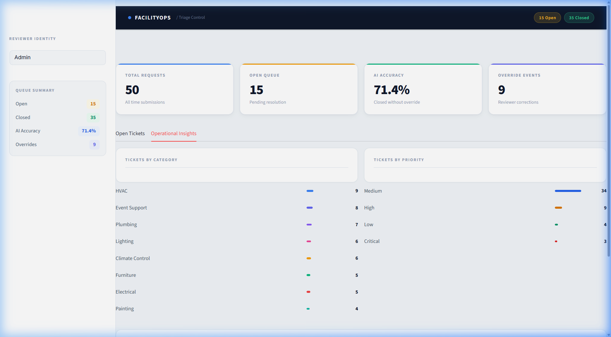
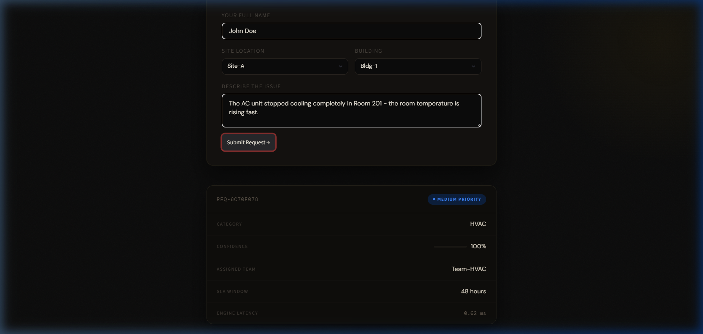
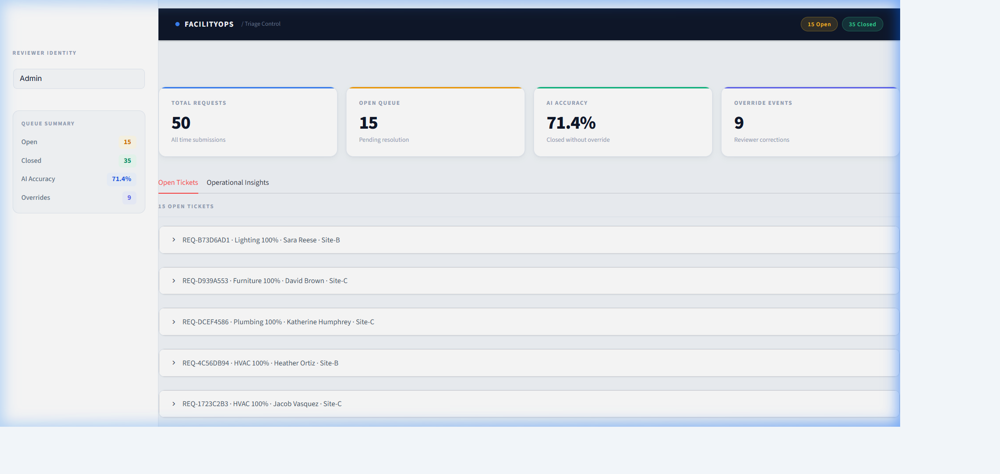
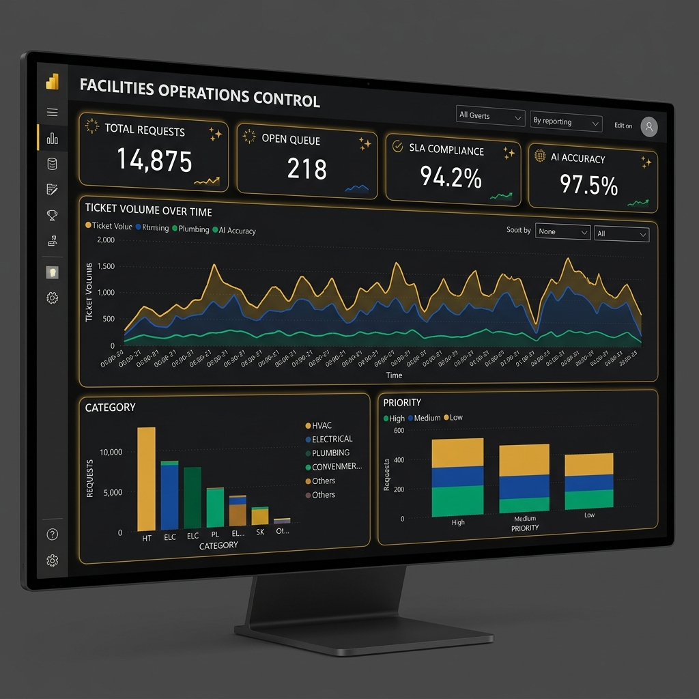
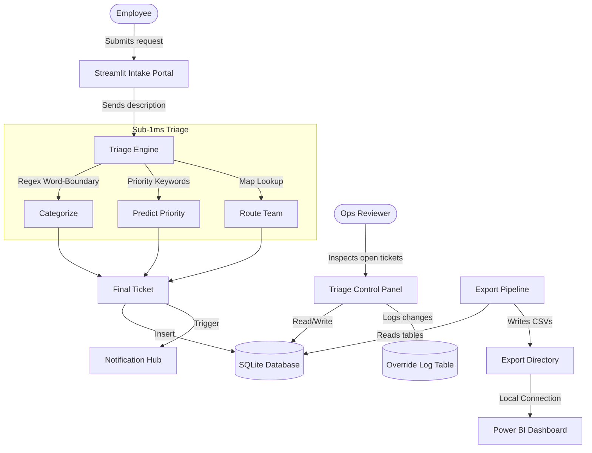

<div align="center">
  
</div>

# Smart Facilities Request Triage System

An end-to-end automation prototype for facility intake, AI-assisted triage, and human-in-the-loop operational analytics.

[](https://www.python.org/)
[](https://streamlit.io/)
[](https://www.sqlite.org/)
[](https://powerbi.microsoft.com/)

---

## The Problem

In most enterprise environments (manufacturing, global facilities, campus management), work request flow is highly manual, relying on emails or unstructured forms. The bottleneck is not the work itself — it is the triage: categorizing the problem, assigning priority, determining the SLA, and dispatching the correct team.

## The Solution

This system replaces manual intake with an end-to-end automation pipeline. It features an ultra-fast rule engine for triage, a professional light-mode operational UI, notification routing, and a strict audit trail for human overrides — modeling the architecture of enterprise CMMS platforms such as Maximo, Planon, and FAMIS.

<div align="center">
  
  
</div>

## Operational Dashboard (Power BI)

The system exports structured, deterministic CSVs (`requests.csv`, `overrides.csv`, `calendar.csv`) designed directly for Power BI. The calendar dimension guarantees non-overlapping dates for accurate time-series reporting.

<div align="center">
  
  <em>Power BI Dashboard connected to the local CSV extract pipeline</em>
</div>

---

## Key Features

- Sub-1ms Auto-Triage Engine: Instantly parses natural language descriptions to predict category, priority, assigned team, and SLA window.
- Human-in-the-loop Override: A dedicated control panel where operations reviewers can override the AI. Every change is tracked in an immutable override_log table.
- Power BI Ready Data Model: Complete with a deterministic calendar dimension (1000+ dates) for seamless time-series analytics and 365-day seed data distribution.
- Silent Fallback Notification Hub: Pluggable email (SMTP) and Microsoft Teams webhook routes that fail gracefully without breaking the intake pipeline.
- Professional Light UI: Built with Streamlit and heavily customized with raw CSS for a clean, clinical SaaS aesthetic — white cards, navy navigation, blue accent system, Inter typography.

---

## System Architecture



---

## Technical Rigor and Auditing

This project was built to pass a senior-level engineering review.

- Input guarding: `triage(None)` is safe and returns a valid default result.
- Database integrity: Schema uses `UNIQUE` constraints on ticket IDs and `DEFAULT` values on all nullable columns.
- Deterministic widget keys: Zero Streamlit key collision risk across all expanders and form controls.
- Secure matching: Word-boundary `re.search` avoids substring false positives (e.g., `ac` does not match inside `replacement`).

---

## How to Run Locally

### 1. Setup Environment

```bash
git clone https://github.com/yourusername/facilities-triage-system.git
cd facilities-triage-system
pip install "streamlit>=1.27" pandas faker requests
```

### 2. Initialize Database and Seed Data

```bash
python scripts/init_db.py
python scripts/generate_calendar.py
python scripts/seed_data.py
python scripts/export_for_powerbi.py
```

### 3. Launch the Applications

The project uses two separate Streamlit apps to simulate role-based access. Open two terminals:

**Terminal 1 — User Portal:**

```bash
streamlit run app/user_form.py --server.port 8501
```

**Terminal 2 — Admin Control Center:**

```bash
streamlit run app/admin_panel.py --server.port 8502
```

### 4. Connect Power BI

Open Power BI Desktop and import the flat files generated in `data/exports/` (`requests.csv`, `overrides.csv`, `calendar.csv`). Establish the relationship between `calendar[Date]` and `requests[SubmittedDate]`. See `docs/powerbi_dax_guide.md` for all 5 page layouts and 12 DAX measures.

---

## Honest Positioning

This project is a polished prototype for portfolio demonstration. In a true enterprise production environment:

1. Database: SQLite would be replaced with PostgreSQL or MS SQL Server.
2. Auth: Streamlit session state would be replaced with proper SSO/SAML integration such as Azure AD.
3. Engine: The regex rule engine would serve as a v1 baseline, eventually transitioning to an ML text classifier trained on the override_log data to improve accuracy over time.
